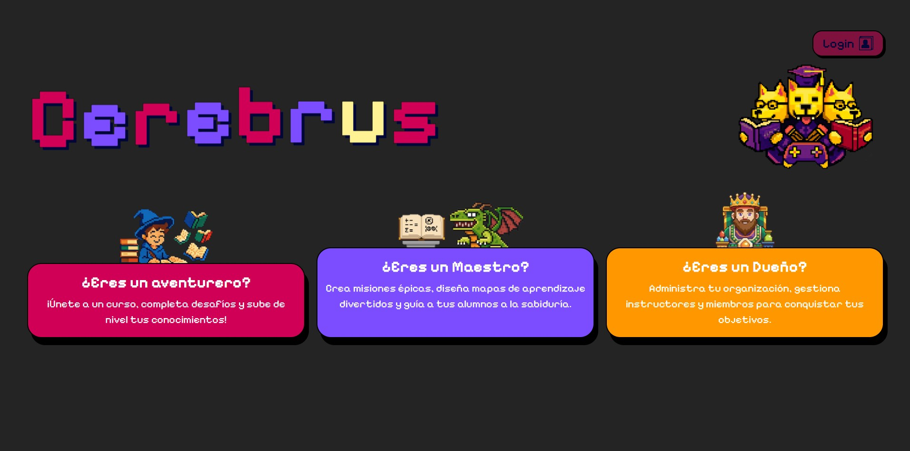
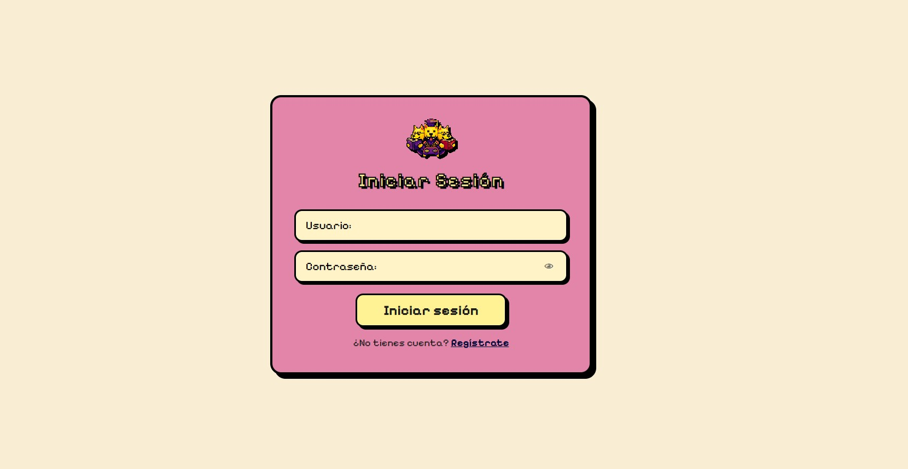

# Guía de Uso — CerebrUS

¡Bienvenido a **CerebrUS**, la aplicación educativa con la que aprenderás jugando!

En esta guía le llevaremos de la mano por todas nuestras funcionalidades, intentando ser lo más claros posible para evitar dudas. Nuestro objetivo es que la aplicación sea sencilla de usar sin necesidad de explicaciones, pero ¡seguimos trabajando en ello! Le animamos también a explorar y experimentar libremente. Eso sí, los casos aquí descritos son los que hemos probado exhaustivamente y podemos garantizar que funcionan correctamente; fuera de ellos no podemos asegurar el comportamiento de la aplicación.

Por supuesto, cualquier dato o información que introduzca —como el contenido de los cursos— puede ser totalmente inventado, copiado de Internet o simplemente texto de prueba (el clásico *"sdafskjdfskjdfn..."*). Nos encontramos en una fase de prueba y el contenido no es realmente importante ni se trasladará a la versión final.

> **⚠️ Nota:** Hemos detectado un error en el despliegue que aún no hemos podido resolver: algunos textos aparecen con letra blanca sobre fondo claro, haciéndolos casi imposibles de leer. Puede seleccionarlos con el ratón para ver su contenido, o simplemente continuar sin preocuparse demasiado. Estamos trabajando en solucionarlo para la próxima versión.

---

## ⚡ Instrucciones de acceso (importante)

Debido a que nos encontramos en una fase inicial, el servidor donde está alojada la aplicación entra en **"modo reposo"** cuando no se utiliza. Si nadie ha accedido durante un período prolongado, la página puede tardar entre **4 y 5 minutos** en activarse.

Para asegurarse de que el sistema está listo, siga estos pasos:

1. **Haga clic en el [Enlace de Activación](https://cerebrus-backend.onrender.com)** (o copie y pegue `https://cerebrus-backend.onrender.com` en una nueva pestaña del navegador).
2. Espere unos minutos. Puede aprovechar para ir a por un café, al baño o ver un par de vídeos en el móvil... tarda aproximadamente 4-5 minutos.
3. Cuando vea una pantalla blanca con un mensaje técnico como *"Whitelabel Error Page"*, significa que el sistema **ya está activo y listo**.
4. A partir de ese momento, acceda a la aplicación desde el enlace principal: **[Acceder a CerebrUS](https://cerebrus-frontend.onrender.com)** (o copie y pegue `https://cerebrus-frontend.onrender.com` en el navegador).

Una vez aclarado esto... ¡al lío!

---

## Pantalla principal

---

## 1. Creación de usuario

No es necesario crear un usuario: nosotros le facilitaremos las credenciales. Esta parte de la aplicación es provisional mientras implementamos la funcionalidad definitiva, así que corramos un tupido velo. En cualquier caso, si experimentara algún problema con las credenciales proporcionadas, puede registrarse como alumno o como maestro sin ningun problema.

---

## 2. Inicio de sesión

Con las credenciales enviadas por correo podrá iniciar sesión tanto como maestro, o como alumno con las credenciales de alumno, aunque en este último nos centraremos más adelante. De momento, inicie sesión como **maestro** y continuemos.

La propia página le redirigirá automáticamente a la vista de sus cursos. En caso de que no ocurra, pulse **"Mis Cursos"** en la barra de navegación superior.

Antes de continuar, conviene entender cómo está organizada la aplicación:

> Un **curso** equivale a una asignatura; por ejemplo, *"Matemáticas 6ºA"* o *"Lengua 5ºB"*. Cada curso contiene **temas**, y cada tema contiene **actividades**. Por ejemplo, *"Matemáticas 6ºB"* tendría el *"Tema 1: Fracciones"*, con distintas actividades asociadas a ese tema.

---

## 3. Mis cursos

Las cuentas están recién creadas, así que de momento no habrá ningún curso. Procedamos a crear uno.

---

## 4. Crear un curso

Pulse sobre **"+ Crear nuevo curso"** para acceder al formulario de creación. Aquí podrá asignar al curso un título, una descripción y, opcionalmente, una imagen mediante URL.

Hay dos aspectos importantes en esta vista. En el caso de que quiera probar también el flujo de navegación de un alumno (totalmente opcional) le recomendamos lo siguiente:
- **Visibilidad:** Si el curso no está marcado como visible, ningún alumno podrá verlo ni unirse a él. Cambie su visibilidad.
- **Código del curso:** Este código es el que deben introducir los alumnos para unirse. Le recomendamos copiarlo y guardarlo en un lugar accesible, o en el propio portapapeles de Windows.

> 💡 **Consejo para usuarios de Windows:** Pulse las teclas **Windows + V** para acceder al historial del portapapeles y recuperar elementos copiados anteriormente, aunque haya copiado otra cosa después.

Una vez creado el curso, este aparecerá en su cuenta.

---

## 5. Vista del curso

Desde esta vista tiene acceso a los siguientes apartados:

- **Editar detalles del curso:** Permite modificar el título, descripción o imagen del curso.
- **Estadísticas:** Actualmente en desarrollo. De momento solo muestra la media de puntuación, lo cual aporta información limitada, pero estamos trabajando en ampliarla.
- **Mapa del curso:** El apartado principal. Haga clic en él para continuar.

---

## 6. Mapa del curso

Al acceder por primera vez, el curso estará vacío, sin temas todavía.

---

## 7. Crear un tema

Pulse en **"+ Añadir tema"**. El formulario es muy sencillo: con un título es suficiente.

Tras crearlo, el panel quedará así:

---

## 8. Crear actividades

Ya puede empezar a añadir actividades. Si ha creado más de un tema, deberá seleccionar en el panel izquierdo el tema al que desea añadir la actividad. Si solo tiene uno, ya estará seleccionado por defecto.

Pulse en **"+ Añadir actividad"** para acceder a la siguiente vista:

Existen tres tipos de actividades disponibles:

---

### 8.1. Actividad de Teoría

La actividad de teoría es la más sencilla: consiste en un **título** y un **cuadro de texto** donde introducir el contenido teórico. Los alumnos lo leerán y continuarán. La interacción por su parte es mínima, pero la teoría es la base del aprendizaje, ¡y sin base no hay castillo!

---

### 8.2. Actividad Tipo Test

Esta actividad incluye:

- **Título**, **descripción** y **puntuación máxima** que se otorga al alumno al completarla con éxito.
- **URL de imagen** (opcional): puede asociarse una imagen al enunciado del test.
- **Correcciones visibles:** esta opción aún no está implementada; puede ignorarla.

En el bloque inferior se crean las **preguntas del test**. Puede añadir tantas como desee. En cada pregunta se escribe el enunciado y las opciones de respuesta, marcando con ✓ la correcta. Si hay más de dos opciones, puede eliminar las que sobren con el botón correspondiente.

---

### 8.3. Actividad de Ordenación

Esta actividad pide al alumno que organice una serie de elementos en el orden correcto. Puede trabajar con **imágenes** o con **texto**; le recomendamos comenzar con texto por simplicidad.

Introduzca los elementos *en el orden correcto* y CerebrUS se encargará de presentárselos al alumno de forma aleatoria para que los reorganice.

El bloque superior es idéntico al del tipo test (título, descripción, puntuación y la casilla "Correcciones visibles", que puede ignorar).

---

## 9. Vista del alumno

Una vez completada la parte del maestro, le describimos brevemente cómo funciona la experiencia como alumno.

Si inicia sesión con una cuenta de alumno (cuyas credenciales también le hemos enviado por correo, o puede crearse una cuenta nueva si lo prefiere), llegará a una vista similar, pero en lugar de crear cursos, solo podrá **unirse a uno** mediante el **código del curso** que anotó anteriormente.

Tras introducir el código y unirse, **actualice la página** para que el curso aparezca en su lista. A partir de ahí, podrá acceder al curso, ver los temas y realizar las actividades.

> **Nota:** De momento no existen restricciones de progresión ni se calculan puntuaciones totales. Llevamos solo unas semanas de desarrollo, ¡pero estamos en ello! Esperamos mejorar considerablemente esta parte en la siguiente versión. Cualquier comentario o feedback al respecto es más que bienvenido.

---

## Agradecimientos

Sin más, le agradecemos su tiempo, su lectura y su participación en nuestro plan de usuarios piloto. Y, sobre todo, gracias por la labor educativa que realizan día a día con los más jóvenes: no es nada fácil, pero sí muy bonita.

**¡CerebrUS — sigamos jugando, sigamos aprendiendo!**

---

## Tabla de versiones

| Versión | Fecha      | Descripción                                                        |
|---------|------------|--------------------------------------------------------------------|
| 1.0.0   | 08/03/2026 | Primera versión de la guía de uso para usuarios piloto.            |
